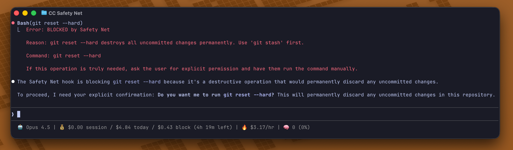

# Claude Code Safety Net

[](https://github.com/kenryu42/claude-code-safety-net/actions/workflows/ci.yml)
[](https://codecov.io/github/kenryu42/claude-code-safety-net)
[](https://github.com/kenryu42/claude-code-safety-net)
[](https://platform.claude.com/docs/en/agent-sdk/plugins)
[](https://opencode.ai/docs/plugins/)
[](https://github.com/kenryu42/gemini-safety-net)
[](https://opensource.org/licenses/MIT)

<div align="center">

[](https://github.com/kenryu42/claude-code-safety-net)

</div>

A Claude Code plugin that acts as a safety net, catching destructive git and filesystem commands before they execute.

## Contents

- [Why This Exists](#why-this-exists)
- [Why Use This Instead of Permission Deny Rules?](#why-use-this-instead-of-permission-deny-rules)
- [What About Sandboxing?](#what-about-sandboxing)
- [Prerequisites](#prerequisites)
- [Quick Start](#quick-start)
  - [Claude Code Installation](#claude-code-installation)
  - [OpenCode Installation](#opencode-installation)
  - [Gemini CLI Installation](#gemini-cli-installation)
- [Commands Blocked](#commands-blocked)
- [Commands Allowed](#commands-allowed)
- [What Happens When Blocked](#what-happens-when-blocked)
- [Testing the Hook](#testing-the-hook)
- [Development](#development)
- [Custom Rules (Experimental)](#custom-rules-experimental)
  - [Config File Location](#config-file-location)
  - [Rule Schema](#rule-schema)
  - [Matching Behavior](#matching-behavior)
  - [Examples](#examples)
  - [Error Handling](#error-handling)
- [Advanced Features](#advanced-features)
  - [Strict Mode](#strict-mode)
  - [Paranoid Mode](#paranoid-mode)
  - [Shell Wrapper Detection](#shell-wrapper-detection)
  - [Interpreter One-Liner Detection](#interpreter-one-liner-detection)
  - [Secret Redaction](#secret-redaction)
  - [Audit Logging](#audit-logging)
- [License](#license)

## Why This Exists

We learned the [hard way](https://www.reddit.com/r/ClaudeAI/comments/1pgxckk/claude_cli_deleted_my_entire_home_directory_wiped/) that instructions aren't enough to keep AI agents in check.
After Claude Code silently wiped out hours of progress with a single `rm -rf ~/` or `git checkout --`, it became evident that **"soft"** rules in an `CLAUDE.md` or `AGENTS.md` file cannot replace **hard** technical constraints.
The current approach is to use a dedicated hook to programmatically prevent agents from running destructive commands.

## Why Use This Instead of Permission Deny Rules?

Claude Code's `.claude/settings.json` supports [deny rules](https://code.claude.com/docs/en/iam#tool-specific-permission-rules) with wildcard matching (e.g., `Bash(git reset --hard:*)`). Here's how this plugin differs:

### At a Glance

| | Permission Deny Rules | Safety Net |
|---|---|---|
| **Setup** | Manual configuration required | Works out of the box |
| **Parsing** | Wildcard pattern matching | Semantic command analysis |
| **Execution order** | Runs second | Runs first (PreToolUse hook) |
| **Shell wrappers** | Not handled automatically (must match wrapper forms) | Recursively analyzed (5 levels) |
| **Interpreter one-liners** | Not handled automatically (must match interpreter forms) | Detected and blocked |

### Permission Rules Have Known Bypass Vectors

Even with wildcard matching, Bash permission patterns are intentionally limited and can be bypassed in many ways:

| Bypass Method | Example |
|---------------|---------|
| Options before value | `curl -X GET http://evil.com` bypasses `Bash(curl http://evil.com:*)` |
| Shell variables | `URL=http://evil.com && curl $URL` bypasses URL pattern |
| Flag reordering | `rm -r -f /` bypasses `Bash(rm -rf:*)` |
| Extra whitespace | `rm  -rf /` (double space) bypasses pattern |
| Shell wrappers | `sh -c "rm -rf /"` bypasses `Bash(rm:*)` entirely |

### Safety Net Handles What Patterns Can't

| Scenario | Permission Rules | Safety Net |
|----------|------------------|------------|
| `git checkout -b feature` (safe) | Blocked by `Bash(git checkout:*)` | Allowed |
| `git checkout -- file` (dangerous) | Blocked by `Bash(git checkout:*)` | Blocked |
| `rm -rf /tmp/cache` (safe) | Blocked by `Bash(rm -rf:*)` | Allowed |
| `rm -r -f /` (dangerous) | Allowed (flag order) | Blocked |
| `bash -c 'git reset --hard'` | Allowed (wrapper) | Blocked |
| `python -c 'os.system("rm -rf /")'` | Allowed (interpreter) | Blocked |

### Defense in Depth

PreToolUse hooks run [**before**](https://code.claude.com/docs/en/iam#additional-permission-control-with-hooks) the permission system. This means Safety Net inspects every command first, regardless of your permission configuration. Even if you misconfigure deny rules, Safety Net provides a fallback layer of protection.

**Use both together**: Permission deny rules for quick, user-configurable blocks; Safety Net for robust, bypass-resistant protection that works out of the box.

## What About Sandboxing?

Claude Code offers [native sandboxing](https://code.claude.com/docs/en/sandboxing) that provides OS-level filesystem and network isolation. Here's how it compares to Safety Net:

### Different Layers of Protection

| | Sandboxing | Safety Net |
|---|---|---|
| **Enforcement** | OS-level (Seatbelt/bubblewrap) | Application-level (PreToolUse hook) |
| **Approach** | Containment — restricts filesystem + network access | Command analysis — blocks destructive operations |
| **Filesystem** | Writes restricted (default: cwd); reads are broad by default | Only destructive operations blocked |
| **Network** | Domain-based proxy filtering | None |
| **Git awareness** | None | Explicit rules for destructive git operations |
| **Bypass resistance** | High — OS enforces boundaries | Lower — analyzes command strings only |

### Why Sandboxing Isn't Enough

Sandboxing restricts filesystem + network access, but it doesn't understand whether an operation is destructive within those boundaries. These commands are not blocked by the sandbox boundary:

> [!NOTE]
> Whether they're auto-run or require confirmation depends on your sandbox mode (auto-allow vs regular permissions), and network access still depends on your allowed-domain policy. Claude Code can also retry a command outside the sandbox via `dangerouslyDisableSandbox` (with user permission); this can be disabled with `allowUnsandboxedCommands: false`.

| Command | Sandboxing | Safety Net |
|---------|------------|------------|
| `git reset --hard` | Allowed (within cwd) | **Blocked** |
| `git checkout -- .` | Allowed (within cwd) | **Blocked** |
| `git stash clear` | Allowed (within cwd) | **Blocked** |
| `git push --force` | Allowed (if remote domain is allowed) | **Blocked** |
| `rm -rf .` | Allowed (within cwd) | **Blocked** |

Sandboxing sees `git reset --hard` as a safe operation—it only modifies files within the current directory. But you just lost all uncommitted work.

### When to Use Sandboxing Instead

Sandboxing is the better choice when your primary concern is:

- **Prompt injection attacks** — Reduces exfiltration risk by restricting outbound domains (depends on your allowed-domain policy)
- **Malicious dependencies** — Limits filesystem writes and network access by default (subject to your sandbox configuration)
- **Untrusted code execution** — OS-level containment is stronger than pattern matching
- **Network control** — Safety Net has no network protection

### Recommended: Use Both

They protect against different threats:

- **Sandboxing** contains blast radius — even if something goes wrong, damage is limited to cwd and approved network domains
- **Safety Net** prevents footguns — catches git-specific mistakes that are technically "safe" from the sandbox's perspective

Running both together provides defense-in-depth. Sandboxing handles unknown threats; Safety Net handles known destructive patterns that sandboxing permits.

## Prerequisites

- **Node.js**: Version 18 or higher is required to run this plugin

## Quick Start

### Claude Code Installation

```bash
/plugin marketplace add kenryu42/cc-marketplace
/plugin install safety-net@cc-marketplace
```

> [!NOTE]
> After installing the plugin, you need to restart your Claude Code for it to take effect.

### Claude Code Auto-Update

1. Run `/plugin` → Select `Marketplaces` → Choose `cc-marketplace` → Enable auto-update

---

### OpenCode Installation

**Option A: Let an LLM do it**

Paste this into any LLM agent (Claude Code, OpenCode, Cursor, etc.):

```
Install the cc-safety-net plugin in `~/.config/opencode/opencode.json` (or `.jsonc`) according to the schema at: https://opencode.ai/config.json

Then copy the following files to `~/.config/opencode/command/`:
- https://raw.githubusercontent.com/kenryu42/claude-code-safety-net/main/.opencode/command/set-custom-rules.md
- https://raw.githubusercontent.com/kenryu42/claude-code-safety-net/main/.opencode/command/verify-custom-rules.md
```

**Option B: Manual setup**

1. **Add the plugin to your config** `~/.config/opencode/opencode.json` (or `.jsonc`):

  ```json
  {
    "plugin": ["cc-safety-net"]
  }
  ```

2. **Copy the [commands](.opencode/command) to `~/.config/opencode/command/`**

---

### Gemini CLI Installation

```bash
gemini extensions install https://github.com/kenryu42/gemini-safety-net
```

> [!IMPORTANT]
> You need to set the following settings in `.gemini/settings.json` to enable hooks:
> ```json
> {
>   "tools": {
>     "enableHooks": true
>   }
> }
> ```

## Commands Blocked

| Command Pattern | Why It's Dangerous |
|-----------------|-------------------|
| git checkout -- files | Discards uncommitted changes permanently |
| git checkout \<ref\> -- \<path\> | Overwrites working tree with ref version |
| git restore files | Discards uncommitted changes |
| git restore --worktree | Explicitly discards working tree changes |
| git reset --hard | Destroys all uncommitted changes |
| git reset --merge | Can lose uncommitted changes |
| git clean -f | Removes untracked files permanently |
| git push --force / -f | Destroys remote history |
| git branch -D | Force-deletes branch without merge check |
| git stash drop | Permanently deletes stashed changes |
| git stash clear | Deletes ALL stashed changes |
| git worktree remove --force | Force-deletes worktree without checking for changes |
| rm -rf (paths outside cwd) | Recursive file deletion outside the current directory |
| rm -rf / or ~ or $HOME | Root/home deletion is extremely dangerous |
| find ... -delete | Permanently removes files matching criteria |
| xargs rm -rf | Dynamic input makes targets unpredictable |
| xargs \<shell\> -c | Can execute arbitrary commands |
| parallel rm -rf | Dynamic input makes targets unpredictable |
| parallel \<shell\> -c | Can execute arbitrary commands |

## Commands Allowed

| Command Pattern | Why It's Safe |
|-----------------|--------------|
| git checkout -b branch | Creates new branch |
| git checkout --orphan | Creates orphan branch |
| git restore --staged | Only unstages, doesn't discard |
| git restore --help/--version | Help/version output |
| git branch -d | Safe delete with merge check |
| git clean -n / --dry-run | Preview only |
| git push --force-with-lease | Safe force push |
| rm -rf /tmp/... | Temp directories are ephemeral |
| rm -rf /var/tmp/... | System temp directory |
| rm -rf $TMPDIR/... | User's temp directory |
| rm -rf ./... (within cwd) | Limited to current working directory |

## What Happens When Blocked

When a destructive command is detected, the plugin blocks the tool execution and provides a reason.

Example output:
```text
BLOCKED by Safety Net

Reason: git checkout -- discards uncommitted changes permanently. Use 'git stash' first.

Command: git checkout -- src/main.py

If this operation is truly needed, ask the user for explicit permission and have them run the command manually.
```

## Testing the Hook

You can manually test the hook by attempting to run blocked commands in Claude Code:

```bash
# This should be blocked
git checkout -- README.md

# This should be allowed
git checkout -b test-branch
```

## Development

See [CONTRIBUTING.md](CONTRIBUTING.md) for details on how to contribute to this project.

## Custom Rules (Experimental)

Beyond the built-in protections, you can define your own blocking rules to enforce team conventions or project-specific safety policies.

> [!TIP]
> Use `/set-custom-rules` to create custom rules interactively with natural language.

### Quick Example

Create `.safety-net.json` in your project root:

```json
{
  "version": 1,
  "rules": [
    {
      "name": "block-git-add-all",
      "command": "git",
      "subcommand": "add",
      "block_args": ["-A", "--all", "."],
      "reason": "Use 'git add <specific-files>' instead of blanket add."
    }
  ]
}
```

Now `git add -A`, `git add --all`, and `git add .` will be blocked with your custom message.

### Config File Location

Config files are loaded from two scopes and merged:

1. **User scope**: `~/.cc-safety-net/config.json` (always loaded if exists)
2. **Project scope**: `.safety-net.json` in the current working directory (loaded if exists)

**Merging behavior**:
- Rules from both scopes are combined
- If the same rule name exists in both scopes, **project scope wins**
- Rule name comparison is case-insensitive (`MyRule` and `myrule` are considered duplicates)

This allows you to define personal defaults in user scope while letting projects override specific rules.

If no config file is found in either location, only built-in rules apply.

### Config Schema

| Field | Type | Required | Description |
|-------|------|----------|-------------|
| `version` | integer | Yes | Schema version (must be `1`) |
| `rules` | array | No | List of custom blocking rules (defaults to empty) |

### Rule Schema

| Field | Type | Required | Description |
|-------|------|----------|-------------|
| `name` | string | Yes | Unique identifier (letters, numbers, hyphens, underscores; max 64 chars) |
| `command` | string | Yes | Base command to match (e.g., `git`, `npm`, `docker`) |
| `subcommand` | string | No | Subcommand to match (e.g., `add`, `install`). If omitted, matches any. |
| `block_args` | array | Yes | Arguments that trigger the block (at least one required) |
| `reason` | string | Yes | Message shown when blocked (max 256 chars) |

### Matching Behavior

- **Commands** are normalized to basename (`/usr/bin/git` → `git`)
- **Subcommand** is the first non-option argument after the command
- **Arguments** are matched literally (no regex, no glob), with short option expansion
- A command is blocked if **any** argument in `block_args` is present
- **Short options** are expanded: `-Ap` matches `-A` (bundled flags are unbundled)
- **Long options** use exact match: `--all-files` does NOT match `--all`
- Custom rules only add restrictions—they cannot bypass built-in protections

#### Known Limitations

- **Short option expansion**: `-Cfoo` is treated as `-C -f -o -o`, not `-C foo`. Blocking `-f` may false-positive on attached option values.

### Examples

#### Block global npm installs

```json
{
  "version": 1,
  "rules": [
    {
      "name": "block-npm-global",
      "command": "npm",
      "subcommand": "install",
      "block_args": ["-g", "--global"],
      "reason": "Global npm installs can cause version conflicts. Use npx or local install."
    }
  ]
}
```

#### Block dangerous docker commands

```json
{
  "version": 1,
  "rules": [
    {
      "name": "block-docker-system-prune",
      "command": "docker",
      "subcommand": "system",
      "block_args": ["prune"],
      "reason": "docker system prune removes all unused data. Use targeted cleanup instead."
    }
  ]
}
```

#### Multiple rules

```json
{
  "version": 1,
  "rules": [
    {
      "name": "block-git-add-all",
      "command": "git",
      "subcommand": "add",
      "block_args": ["-A", "--all", ".", "-u", "--update"],
      "reason": "Use 'git add <specific-files>' instead of blanket add."
    },
    {
      "name": "block-npm-global",
      "command": "npm",
      "subcommand": "install",
      "block_args": ["-g", "--global"],
      "reason": "Use npx or local install instead of global."
    }
  ]
}
```

### Error Handling

Custom rules use **silent fallback** error handling. If your config file is invalid, the safety net silently falls back to built-in rules only:

| Scenario | Behavior |
|----------|----------|
| Config file not found | Silent — use built-in rules only |
| Empty config file | Silent — use built-in rules only |
| Invalid JSON syntax | Silent — use built-in rules only |
| Missing required field | Silent — use built-in rules only |
| Invalid field format | Silent — use built-in rules only |
| Duplicate rule name | Silent — use built-in rules only |


> [!IMPORTANT]  
> If you add or modify custom rules manually, always validate them with the `/verify-custom-rules` slash command.

### Block Output Format

When a custom rule blocks a command, the output includes the rule name:

```text
BLOCKED by Safety Net

Reason: [block-git-add-all] Use 'git add <specific-files>' instead of blanket add.

Command: git add -A
```

## Advanced Features

### Strict Mode

By default, unparseable commands are allowed through. Enable strict mode to fail-closed
when the hook input or shell command cannot be safely analyzed (e.g., invalid JSON,
unterminated quotes, malformed `bash -c` wrappers):

```bash
export SAFETY_NET_STRICT=1
```

### Paranoid Mode

Paranoid mode enables stricter safety checks that may be disruptive to normal workflows.
You can enable it globally or via focused toggles:

```bash
# Enable all paranoid checks
export SAFETY_NET_PARANOID=1

# Or enable specific paranoid checks
export SAFETY_NET_PARANOID_RM=1
export SAFETY_NET_PARANOID_INTERPRETERS=1
```

Paranoid behavior:

- **rm**: blocks non-temp `rm -rf` even within the current working directory.
- **interpreters**: blocks interpreter one-liners like `python -c`, `node -e`, `ruby -e`,
  and `perl -e` (these can hide destructive commands).

### Shell Wrapper Detection

The guard recursively analyzes commands wrapped in shells:

```bash
bash -c 'git reset --hard'    # Blocked
sh -lc 'rm -rf /'             # Blocked
```

### Interpreter One-Liner Detection

Detects destructive commands hidden in Python/Node/Ruby/Perl one-liners:

```bash
python -c 'import os; os.system("rm -rf /")'  # Blocked
```

### Secret Redaction

Block messages automatically redact sensitive data (tokens, passwords, API keys) to prevent leaking secrets in logs.

### Audit Logging

All blocked commands are logged to `~/.cc-safety-net/logs/<session_id>.jsonl` for audit purposes:

```json
{"ts": "2025-01-15T10:30:00Z", "command": "git reset --hard", "segment": "git reset --hard", "reason": "...", "cwd": "/path/to/project"}
```

Sensitive data in log entries is automatically redacted.

## License

MIT
